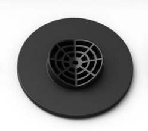
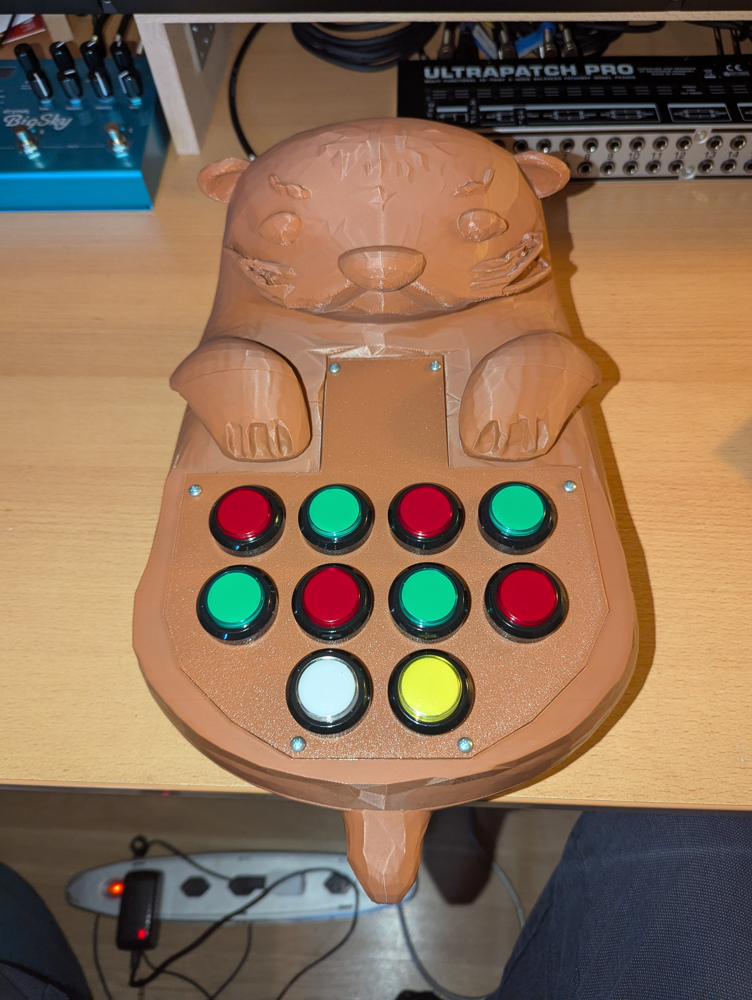
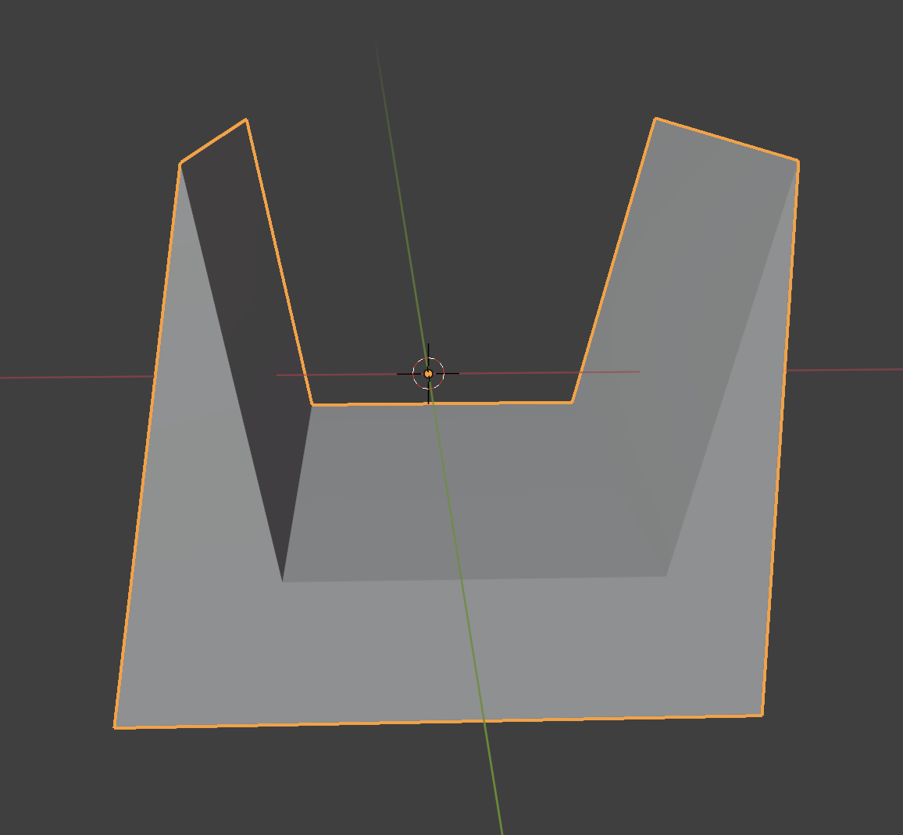
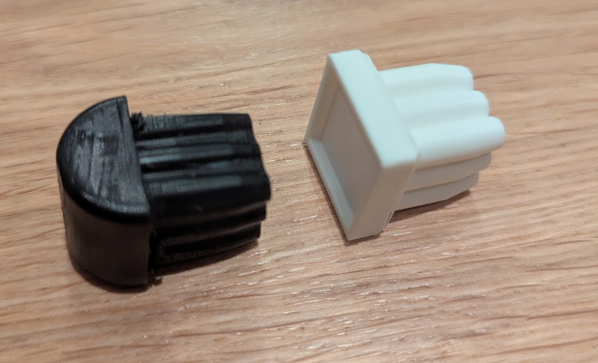
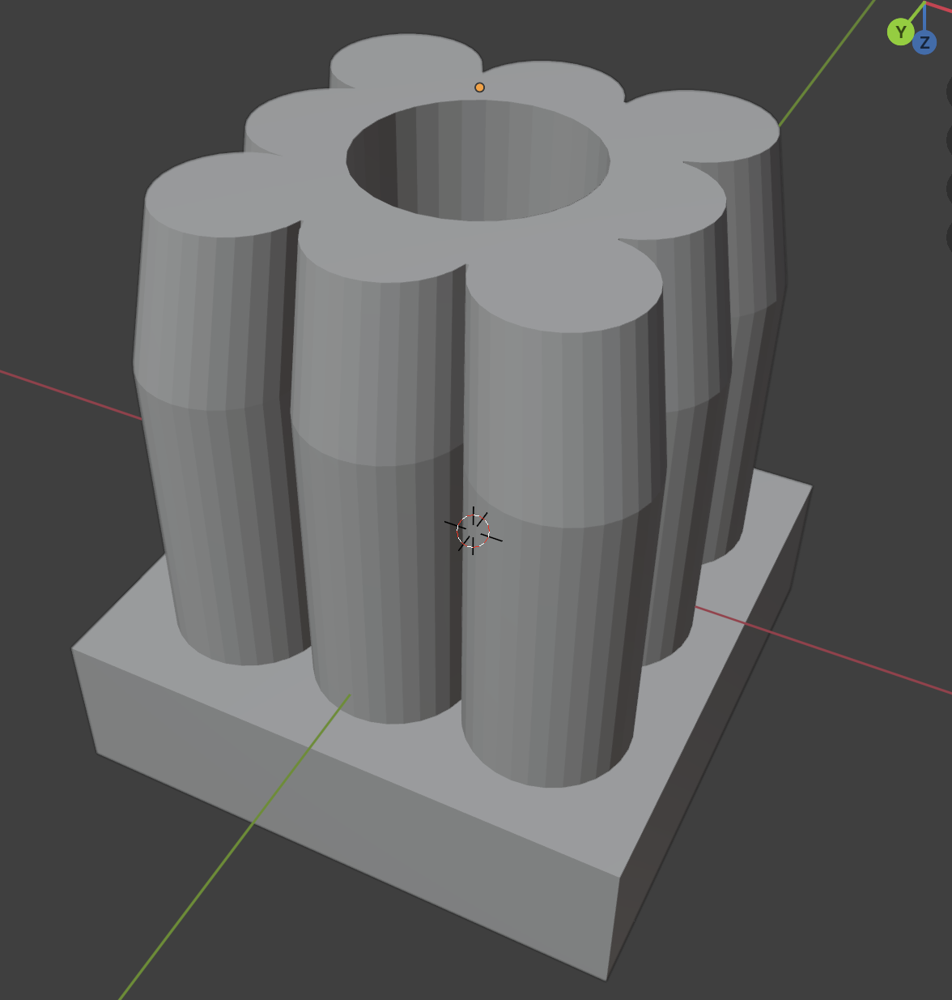

# 3D Printing

## Table of Contents

- [3D Printing](#3d-printing)
  - [Table of Contents](#table-of-contents)
  - [Light Stand for Philips Hue Play Light bar](#light-stand-for-philips-hue-play-light-bar)
  - [Otteri-Synth](#otteri-synth)
  - [Cable holders for ceiling](#cable-holders-for-ceiling)
  - [Chair Leg replacement pieces](#chair-leg-replacement-pieces)
  - [Cake Decoration](#cake-decoration)

    
     
    Let your ideas become reality!

## Light Stand for Philips Hue Play Light bar

The default holder for the Philips light were not optimal for my setup.

So I designed my own and it works well behind my PC screen.

## Otteri-Synth

The full files and information can be found on the specific [Otteri-Synth Repository](https://github.com/Fauli/otteri-synth).

## Cable holders for ceiling

My ceiling has a canal that was ideal for hiding a cable to a lamp, but the cable was to thin to properly put into the canal.

Another challange was that the canal changes width every 15 cm. So I created a piece that can be scaled to different sizes.

## Chair Leg replacement pieces 

My father in law asked if I can design some chair replacement for this dining table chair. The old ones were starting to get torn, so the idea was to create new ones with a sunken in surface for pieces of felt.

The original piece is on the left and the new piece is on the right. 

## Cake Decoration

